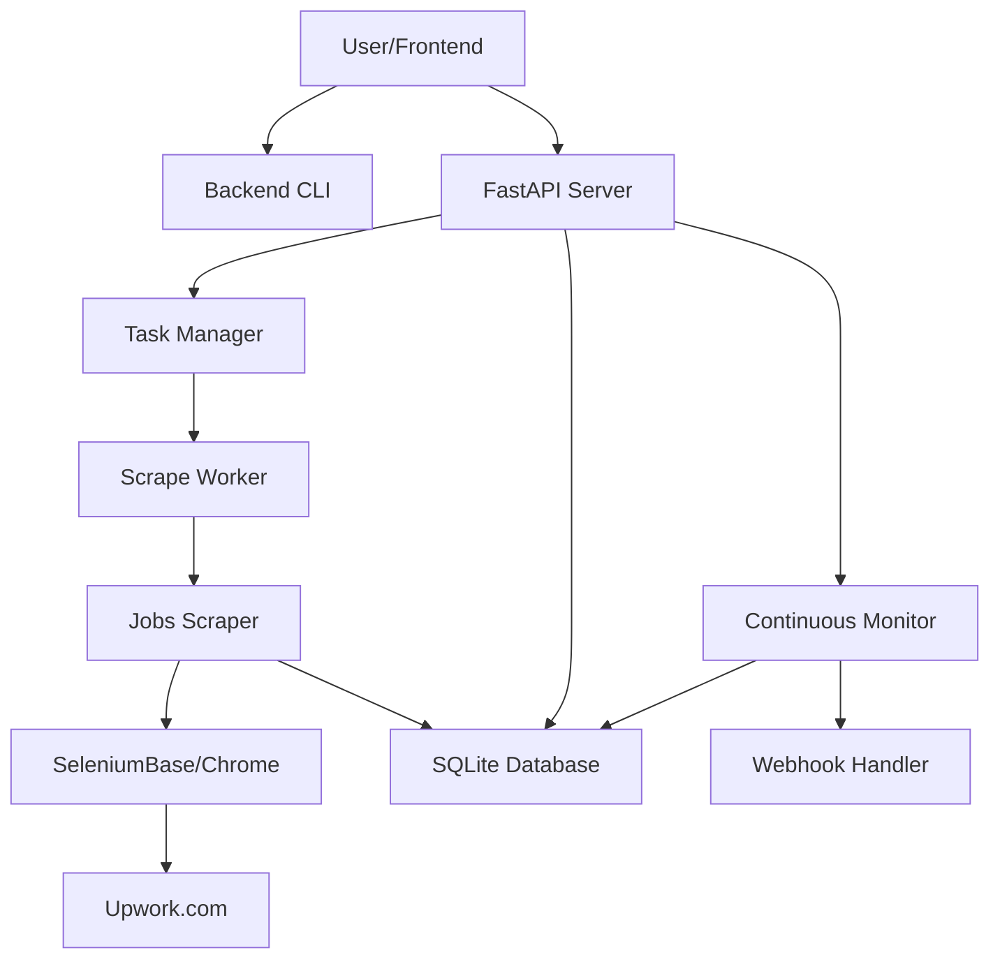
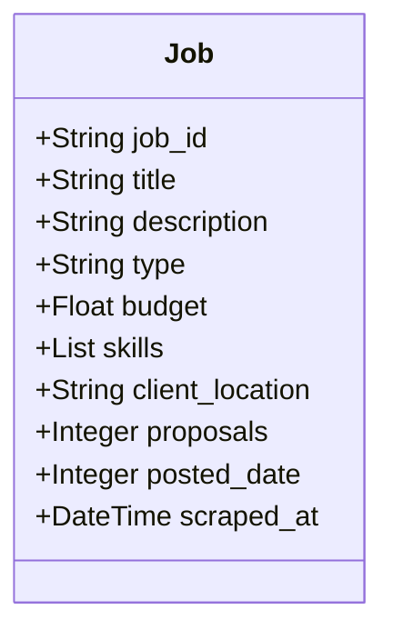

# UML Diagrams

## System Architecture

```mermaid
graph TD
    User[User/Frontend] --> CLI[Backend CLI]
    User --> API[FastAPI Server]
    
    API --> TM[Task Manager]
    TM --> Worker[Scrape Worker]
    
    Worker --> JS[Jobs Scraper]
    JS --> Selenium[SeleniumBase/Chrome]
    Selenium --> Upwork[Upwork.com]
    
    JS --> DB[SQLite Database]
    
    API --> DB
    API --> Monitor[Continuous Monitor]
    Monitor --> DB
    Monitor --> Webhook[Webhook Handler]
```

## Data Model (Job)

```mermaid
classDiagram
    class Job {
        +String job_id
        +String title
        +String description
        +String type
        +Float budget
        +List skills
        +String client_location
        +Integer proposals
        +Integer posted_date
        +DateTime scraped_at
    }
```
